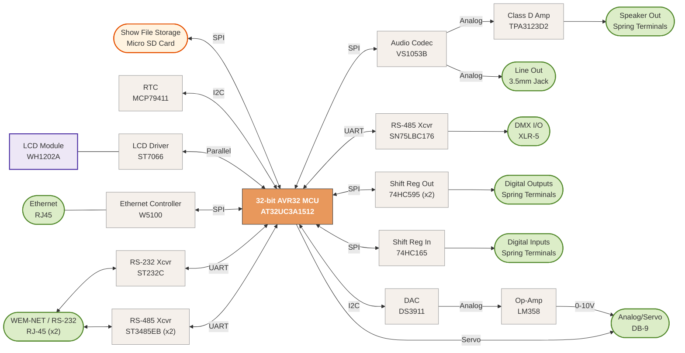

The Weigl ProCommander4 show controller crossed my path recently, and curiosity got the better of me.

<a href="https://www.weiglcontrol.com/" target="_blank" rel="noopener">Weigl Control</a> makes show control equipment for professional and prosumer applications. This is a look at the <a href="https://www.weiglcontrol.com/product/procommander-4/" target="_blank" rel="noopener">ProCommander4</a>'s hardware — what's on the board, how the pieces fit together, and what that tells us about how it works. Impatient readers can [skip straight to the block diagram.](/ProCommander4-Teardown/#system-architecture)<!--more-->

## Rear Panel

The rear panel is where the ProCommander4 connects to the outside world — power in, control signals out, and the interfaces for show control. While the network interface is located on the front panel, the rear panel provides serial interfaces for show control, digital inputs and outputs, servo outputs, analog outputs, and a loudspeaker line out for audio. These connections enable the ProCommander4 to integrate seamlessly into complex animatronic systems.



## PCB — Top View

The main board is where all the interesting work happens. The key ICs are labeled below.

{% include annotated_image.html
   image="/images/Weigl_ProCommander4_Teardown/pcb_top.jpg"
   alt="Weigl ProCommander4 main PCB top view showing AT32UC3A1512 AVR32 MCU, WIZnet W5100 Ethernet, VLSI VS1053B audio codec, TPA3123D2 class D amplifier, DS3911 DAC, and supporting ICs"
   hotspots='[
     {"x":18.6,"y":65.7,"label":"W5100","desc":"WIZnet W5100 — hardwired TCP/IP stack Ethernet controller","url":"https://wiznet.io/products/ethernet-chips/w5100"},
     {"x":16.7,"y":53.3,"label":"TPA3123D2","desc":"TI TPA3123D2 — 25 W per channel class D audio amplifier","url":"https://www.ti.com/lit/ds/symlink/tpa3123d2.pdf"},
     {"x":50.7,"y":61.1,"label":"AT32UC3A1512","desc":"Microchip AT32UC3A1512 — 32-bit AVR32 MCU, 512 KB flash","url":"https://www.microchip.com/en-us/product/at32uc3a1512"},
     {"x":83.2,"y":49.6,"label":"MC34063A","desc":"MC34063A — switching regulator controller","url":"https://www.ti.com/lit/ds/symlink/mc34063a.pdf"},
     {"x":77.6,"y":38,"label":"SN75LBC176","desc":"TI SN75LBC176 — RS-485/RS-422 differential bus transceiver, used here as the DMX output interface","url":"https://www.ti.com/lit/ds/symlink/sn65lbc176.pdf"},
     {"x":34.3,"y":54.4,"label":"VS1053B","desc":"VLSI VS1053B — MP3/OGG/AAC/MIDI audio codec with DSP","url":"https://cdn.sparkfun.com/assets/a/1/9/5/0/vs1053.pdf"},
     {"x":66,"y":79.1,"label":"WH1202A","desc":"Winstar WH1202A-TMI-ET# — 1.6\" 12×2 character LCD, ST7066 HD44780-compatible controller","url":"https://www.first-components.com/en/wh1202a-tmi-et"},
     {"x":39.6,"y":79.3,"label":"Micro SD Card","desc":"Storage medium for show files — audio and cue data read by the MCU at runtime via SPI"},
     {"x":59.2,"y":67.3,"label":"LM358","desc":"TI LM358 — dual op-amp. Function in this location unknown.","url":"https://www.ti.com/lit/ds/symlink/lm358.pdf"},
     {"x":33.3,"y":38.4,"label":"LM358s","desc":"TI LM358 — dual op-amps, used here to scale the DS3911 DAC output voltage up to 0–10 VDC for the rear D-sub analog outputs","url":"https://www.ti.com/lit/ds/symlink/lm358.pdf"},
     {"x":66,"y":65.1,"label":"74HC595","desc":"8-bit serial-in parallel-out shift register — drives digital outputs on the rear connector","url":"https://assets.nexperia.com/documents/data-sheet/74HC_HCT595.pdf"},
     {"x":66,"y":70.8,"label":"74HC595","desc":"8-bit serial-in parallel-out shift register — drives digital outputs on the rear connector","url":"https://assets.nexperia.com/documents/data-sheet/74HC_HCT595.pdf"},
     {"x":52.8,"y":72.1,"label":"74HC165","desc":"8-bit parallel-in serial-out shift register — reads digital inputs from the rear connector","url":"https://assets.nexperia.com/documents/data-sheet/74HC_HCT165.pdf"},
     {"x":40.1,"y":59,"label":"MCP79411","desc":"Microchip MCP79411 — battery-backed I²C real-time clock/calendar (RTCC)","url":"https://ww1.microchip.com/downloads/aemDocuments/documents/MPD/ProductDocuments/DataSheets/MCP79410-MCP79411-MCP79412-Battery-Backed-I2C-RTCC-DS20002266.pdf"},
     {"x":39.6,"y":70.4,"label":"ST232C","desc":"STMicroelectronics ST232C — MAX232-compatible RS-232 transceiver with charge pump","url":"https://www.st.com/en/interfaces-and-transceivers/st232c.html"},
     {"x":26,"y":35.8,"label":"ST232C","desc":"STMicroelectronics ST232C — MAX232-compatible RS-232 transceiver with charge pump","url":"https://www.st.com/en/interfaces-and-transceivers/st232c.html"},
     {"x":40.3,"y":45.8,"label":"DS3911","desc":"Analog Devices DS3911 — quad-channel 10-bit I²C DAC","url":"https://www.analog.com/media/en/technical-documentation/data-sheets/DS3911.pdf"},
     {"x":63.1,"y":47.9,"label":"Relays","desc":"Relays can optionally be installed for outputs on some units. This unit is equipped with N-ch MOSFETs for low-side switching."},
     {"x":46.4,"y":41.9,"label":"ZXMS6004DN8","desc":"60 V, 1.3 A, 500 mΩ N-ch MOSFETs with integrated overcurrent protection","url":"https://www.diodes.com/datasheet/download/ZXMS6004DN8.pdf"},
     {"x":62.9,"y":59.3,"label":"ZXMS6004DN8","desc":"60 V, 1.3 A, 500 mΩ N-ch MOSFETs with integrated overcurrent protection","url":"https://www.diodes.com/datasheet/download/ZXMS6004DN8.pdf"},
     {"x":33.8,"y":68,"label":"ST3485EBs","desc":"Set of RS-485 transceivers for the \"RS232-1/NET-IN\" and \"RS232-2/NET-OUT\" RJ45s","url":"https://www.st.com/resource/en/datasheet/st3485e.pdf"}
   ]'
%}

### AT32UC3A1512 — Main MCU

The central processor is an **<a href="https://www.microchip.com/en-us/product/at32uc3a1512" target="_blank" rel="noopener">Atmel (now Microchip) AT32UC3A1512</a>**, a 32-bit AVR32 microcontroller running at up to 66 MHz with 512 KB of flash and 128 KB of SRAM. The AVR32 UC3 family was Atmel's high-performance embedded controller line, and the A1512 variant includes a full-speed USB device/host controller, a 10/100 Ethernet MAC (used here in conjunction with the external W5100 PHY/stack), SPI, I²C, USART, and a hardware DMA controller. This is the chip executing the show file decoding loop — reading cue data, generating output timing, and coordinating all the peripheral ICs.

### W5100 — Ethernet

The **<a href="https://wiznet.io/products/ethernet-chips/w5100" target="_blank" rel="noopener">WIZnet W5100</a>** is a hardwired TCP/IP stack chip — it handles Ethernet entirely in hardware, so no network stack software runs on the MCU.

### VS1053B — Audio Codec

The **<a href="https://cdn.sparkfun.com/assets/a/1/9/5/0/vs1053.pdf" target="_blank" rel="noopener">VLSI VS1053B</a>** is a single-chip audio codec that handles decoding of MP3, OGG Vorbis, AAC, WMA, FLAC, WAV, and MIDI. It takes compressed audio from the MCU over SPI and outputs an analog stereo signal.

### TPA3123D2 — Class D Amplifier

The **<a href="https://www.ti.com/lit/ds/symlink/tpa3123d2.pdf" target="_blank" rel="noopener">TI TPA3123D2</a>** is a 25 W per channel class D audio power amplifier. It takes the analog stereo output from the VS1053B and drives speakers directly. Class D was the right choice here — it's efficient enough that no heatsink is required in a sealed enclosure at typical animatronic audio levels. The TPA3123D2 operates from a single supply (10–36 V) and includes short-circuit and thermal protection.

### SN75LBC176 — RS-485 Transceiver

The **<a href="https://www.ti.com/lit/ds/symlink/sn65lbc176.pdf" target="_blank" rel="noopener">SN75LBC176</a>** (equivalent to SN65LBC176) is a differential bus transceiver for RS-485 and RS-422 networks — the electrical interface for DMX output.

### MC34063A — DC/DC Converter

The **<a href="https://www.ti.com/lit/ds/symlink/mc34063a.pdf" target="_blank" rel="noopener">MC34063A</a>** is a classic, minimal switching regulator controller containing an oscillator, comparator, and switch transistor in a single package. It is used here to generate one of the internal supply rails from the input power — most likely stepping down the incoming DC to a lower logic voltage. The MC34063A has remained in continuous production for decades; its simplicity makes it a frequent choice when a secondary rail doesn't need high efficiency or tight regulation.

### WH1202A — Character LCD

The **<a href="https://www.first-components.com/en/wh1202a-tmi-et" target="_blank" rel="noopener">Winstar WH1202A-TMI-ET#</a>** is a 1.6″ 12×2 character LCD module with a built-in **ST7066** HD44780-compatible controller — the LCD interface for the unit. The MCU talks directly to the ST7066 on the module.

### DS3911 — Analog Output DAC

The **<a href="https://www.analog.com/media/en/technical-documentation/data-sheets/DS3911.pdf" target="_blank" rel="noopener">DS3911</a>** (Analog Devices / Dallas Semiconductor) is a quad-channel, 10-bit I²C DAC. Its outputs are routed through a set of **LM358** op-amps configured as scaling amplifiers, which bring the DAC's native output range up to 0–10 VDC on the rear connector.

### MCP79411 — Real-Time Clock

The **<a href="https://ww1.microchip.com/downloads/aemDocuments/documents/MPD/ProductDocuments/DataSheets/MCP79410-MCP79411-MCP79412-Battery-Backed-I2C-RTCC-DS20002266.pdf" target="_blank" rel="noopener">Microchip MCP79411</a>** is a battery-backed I²C real-time clock/calendar (RTCC) with 64 bytes of SRAM and a unique ID ROM. Its presence here ensures the ProCommander4 maintains accurate time even when powered off — relevant for any show scheduling, logging, or time-stamped event triggering the firmware implements. The I²C interface keeps the pin count minimal; the battery backup means the clock continues running through power cycles without requiring NTP or user re-entry of the time. A coin cell battery holder is present on the PCB — empty in this unit, but the footprint is there and ready.

The underside of the board is largely solder and passive components, but one feature is worth noting.



### TPA3123D2 Thermal Management

The exposed copper pad visible on the bottom of the board — tinned with solder — is the thermal relief for the **<a href="https://www.ti.com/lit/ds/symlink/tpa3123d2.pdf" target="_blank" rel="noopener">TPA3123D2</a>** class D amplifier directly above it on the top side. Class D amplifiers are efficient but still dissipate heat at the drive currents used for speakers — the TPA3123D2's package includes a large exposed metal pad on the underside of the IC itself, which solders directly to the PCB and conducts heat into the board's copper pour, letting the PCB act as the primary heat dissipator. In a sealed enclosure like this one, conducting heat into the chassis ground plane is the practical alternative to an external heatsink.

## PCB — Network and Playback Region

Zooming into the front-left quadrant of the board brings the network and audio subsystem into focus.

{% include annotated_image.html
   image="/images/Weigl_ProCommander4_Teardown/pcb_top_network_playback.jpg"
   alt="Weigl ProCommander4 PCB network and audio playback region showing WIZnet W5100 Ethernet controller, VLSI VS1053B audio codec, STMicroelectronics ST232C RS-232 transceiver, DS3911 DAC, and 3.5mm line out jack"
   hotspots='[
     {"x":37.2,"y":60.1,"label":"W5100","desc":"WIZnet W5100 — hardwired TCP/IP stack Ethernet controller","url":"https://wiznet.io/products/ethernet-chips/w5100"},
     {"x":30.1,"y":47,"label":"TPA3123D2","desc":"TI TPA3123D2 — 25 W per channel class D audio amplifier","url":"https://www.ti.com/lit/ds/symlink/tpa3123d2.pdf"},
     {"x":76.5,"y":58.8,"label":"ST232C","desc":"STMicroelectronics ST232C — MAX232-compatible RS-232 transceiver with charge pump","url":"https://www.st.com/en/interfaces-and-transceivers/st232c.html"},
     {"x":63.5,"y":43.2,"label":"VS1053B","desc":"VLSI VS1053B — MP3/OGG/AAC/MIDI audio codec with DSP","url":"https://cdn.sparkfun.com/assets/a/1/9/5/0/vs1053.pdf"},
     {"x":60.4,"y":26,"label":"LM358s","desc":"TI LM358 — dual op-amps, used here to scale the DS3911 DAC output voltage up to 0–10 VDC for the rear D-sub analog outputs","url":"https://www.ti.com/lit/ds/symlink/lm358.pdf"},
     {"x":56.7,"y":9.4,"label":"3.5mm Line Out","desc":"Stereo line-level output jack — direct analog audio from the VS1053B codec, bypassing the TPA3123D2 power amplifier for connection to an external amplifier or mixer"},
     {"x":15.4,"y":9.3,"label":"Speaker Terminals","desc":"Spring terminals for direct speaker connections driven by the TPA3123D2 class D amplifier"},
     {"x":43.2,"y":25.4,"label":"ST232C","desc":"STMicroelectronics ST232C — MAX232-compatible RS-232 transceiver with charge pump","url":"https://www.st.com/en/interfaces-and-transceivers/st232c.html"},
     {"x":75,"y":46.5,"label":"MCP79411","desc":"Microchip MCP79411 — battery-backed I²C real-time clock/calendar (RTCC)","url":"https://ww1.microchip.com/downloads/aemDocuments/documents/MPD/ProductDocuments/DataSheets/MCP79410-MCP79411-MCP79412-Battery-Backed-I2C-RTCC-DS20002266.pdf"},
     {"x":70.8,"y":33.2,"label":"DS3911","desc":"Analog Devices DS3911 — quad-channel 10-bit I²C DAC","url":"https://www.analog.com/media/en/technical-documentation/data-sheets/DS3911.pdf"},
     {"x":65.7,"y":56.4,"label":"ST3485EBs","desc":"Set of RS-485 transceivers for the \"RS232-1/NET-IN\" and \"RS232-2/NET-OUT\" RJ45s","url":"https://www.st.com/resource/en/datasheet/st3485e.pdf"},
     {"x":92.5,"y":47,"label":"AT32UC3A1512","desc":"Microchip AT32UC3A1512 — 32-bit AVR32 MCU, 512 KB flash","url":"https://www.microchip.com/en-us/product/at32uc3a1512"}
   ]'
%}

### ST232C — RS-232 Transceiver

The **<a href="https://www.st.com/en/interfaces-and-transceivers/st232c.html" target="_blank" rel="noopener">STMicroelectronics ST232C</a>** is a pin-compatible alternative to the classic Maxim MAX232 — a dual-driver, dual-receiver RS-232 transceiver that generates the ±7.8 V RS-232 signal swings from a single 5 V supply using an internal charge pump and four external capacitors. Finding this alongside the SN75LBC176 RS-485 transceiver means the ProCommander4 has two separate serial port standards: RS-485 for robust multidrop field connections to animatronic figures running over long cable distances, and RS-232 for shorter-range point-to-point use.

### ST3485EB — Front-Panel WEM-NET / RS-232 Ports

The pair of **<a href="https://www.st.com/resource/en/datasheet/st3485e.pdf" target="_blank" rel="noopener">STMicroelectronics ST3485EB</a>** RS-485 transceivers drive the two front-panel RJ45 ports labeled **RS232-1/NET-IN** and **RS232-2/NET-OUT**. Per the ProCommander4 manual, these ports serve a dual purpose: they support Weigl's proprietary **WEM-NET Pro I/O** protocol for interconnecting Weigl devices in a networked show control system, and they can also be used with external RS-232 devices via an optional adapter sold separately. The RJ45 connector carries both the RS-485 signal and power, so connected Weigl devices receive both data and power over a single cable.

### LM358 — Analog Output Scaling

The **<a href="https://www.ti.com/lit/ds/symlink/lm358.pdf" target="_blank" rel="noopener">LM358</a>** dual op-amps visible in this region are configured as scaling amplifiers in the analog output path — they sit between the DS3911 DAC and the rear D-sub connector, amplifying the DAC's native output up to the 0–10 VDC range expected by industrial equipment.

### Audio Outputs — Line Out and Speaker Terminals

The board exposes two audio output paths. The **3.5mm stereo line-out jack** provides a line-level signal taken directly from the VS1053B codec output, bypassing the power amplifier entirely — useful for connecting to an external amplifier, mixer, or audio distribution system in larger installations. The **speaker spring terminals** are the direct-drive output of the TPA3123D2 class D amplifier, intended for connecting 4Ω or 8Ω speakers directly at the enclosure. Having both outputs populated means the same unit can serve either as a self-contained speaker driver or as an audio source node in a larger show audio system.

## System Architecture

Putting it all together, the block diagram below shows how the major components interconnect. The AT32UC3A1512 sits at the center, coordinating every subsystem over SPI, I²C, and UART.

  MCU
  Integrated Circuit
  Connector
  Display
  Generic I/O
  Storage

## Design Notes

Overall the ProCommander4 is a logical, well-considered piece of hardware. The component choices make sense — each part does a clearly defined job, the interconnections are straightforward, and the result is a low parts count design that appears to work reliably. Nothing here is cutting-edge, but that's just fine for a product like this.

For my use case — animatronic systems on moving parade floats — I'd want to see better mechanical robustness. Several larger through-hole components sit freestanding above the board with no staking, and the LCD and front-panel joystick ride on unsupported sub-PCBs that protrude from the front of the unit. Both are the kind of detail that matters when the controller lives on a vehicle or gets handled regularly in the field. For a controller that lives in a fixed rack, the vibration side of that is a non-issue — but the fragile sub-PCB assemblies are worth being careful with regardless of where it's installed. At $1,850.00, these are the kinds of finishing details worth getting right — and it’s worth noting that Weigl requires a login to see pricing at all, which makes comparison shopping unnecessarily difficult for potential buyers.

None of this is a serious criticism — it's a sensible, functional design that clearly does what it's supposed to do.

## Disclaimer

This analysis is based entirely on visual inspection of photographs — no firmware was extracted, no signals were probed, and no attempt was made to produce a schematic or any other detailed reverse engineering artifact. The interconnections shown in the block diagram above are inferred from datasheet-typical usage patterns and the physical proximity of components on the PCB, not from verified traces. Some assumptions are almost certainly wrong.

This is purely a hobbyist exercise in reverse-engineering curiosity — meant to help others understand how a piece of show control hardware is put together at a high level. It is not a competitive analysis, not an attempt to replicate or undermine Weigl's product, and not a criticism of their engineering. <a href="https://www.weiglcontrol.com/" target="_blank" rel="noopener">Weigl Control</a> makes solid equipment, and the goal here is appreciation, not deconstruction.

The fact that <a href="https://www.motalab.com/showforge" target="_blank" rel="noopener">Showforge</a> — the companion show programming software — is macOS-only and requires a USB-C hardware dongle key at $1,300.00 each is another matter, which I'll refrain from sharing my thoughts on. 🙃
