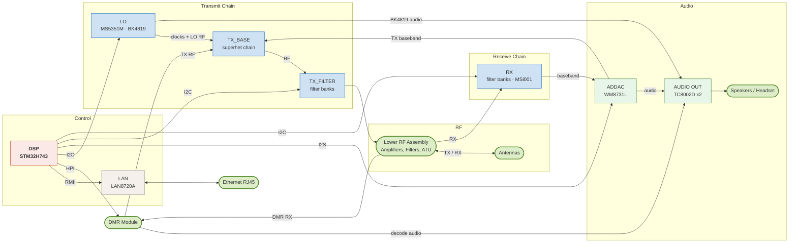
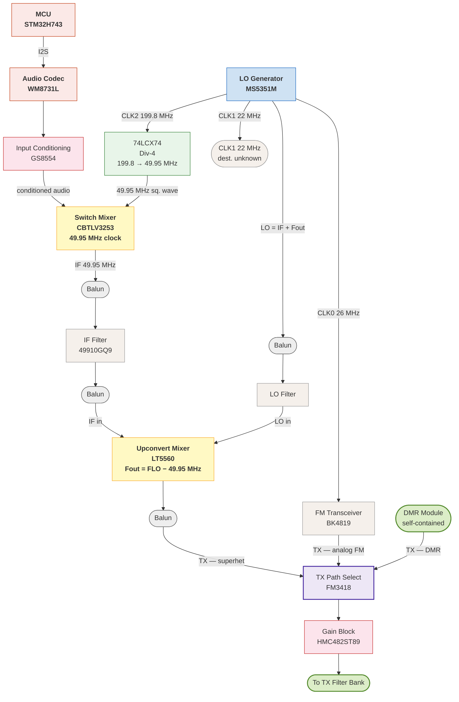
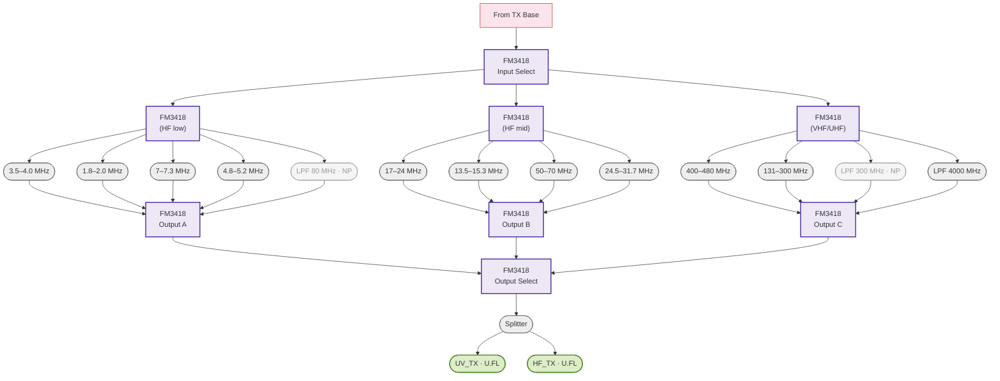
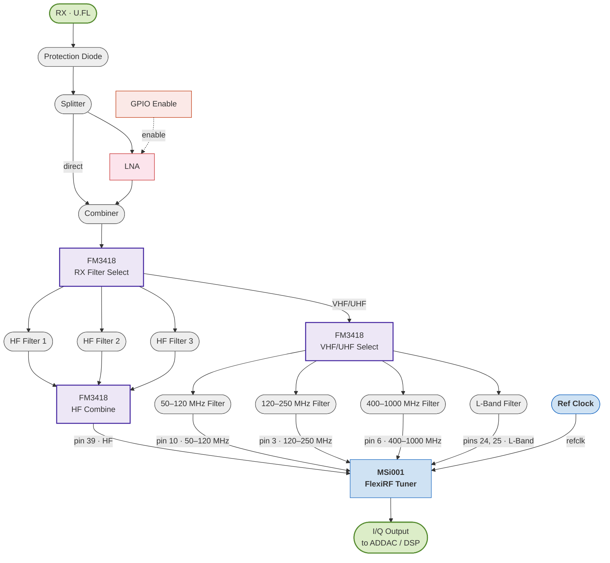

The PMR-171 is a portable all-band SDR transceiver that I recently got my hands on. Naturally I'm curious to know how this HF/VHF/UHF portable SDR works. This post covers the major ICs, signal chains, and how everything connects at a high level.<!--more-->

## Overview

The PMR-171 covers 100 kHz to 2 GHz (for receive at least) across most common amateur modes: SSB, CW, AM, FM, FT8, RTTY, and optionally DMR. It's built around a dual-conversion architecture with a built-in automatic antenna tuner covering 4m through 160m, an internal sound card, and CAT control over a single USB-C connection. The radio has reverse polarity protection on the DC input, weighs under 2 kg, and ships as a complete package with a snap-on 5 Ah battery carrier.

The reference oscillator is reportedly a TCXO rated at ±0.5 ppm from -10°C to 60°C. There's Bluetooth for wireless control (including FT8 operation without a wired common-mode interference path), an Ethernet port (doesn't seem functional yet), and optional DMR, GPS, and compass/barometer modules.

Some position it in the same space as the Icom IC-705, Xiegu X6100, and Yaesu FT-817. A do-everything portable SDR at a lower price point from a smaller manufacturer. Whether it delivers on all of that is a separate discussion; this post is just about what's inside.

## Upper PCB

The upper board carries the radio's main processing and RF control circuitry. The key ICs are labeled below. The photo below shows the board as-received — no RF shields have been removed because there aren't any. The ground stitching traces visible around each functional section are clearly designed to seat RF shield cans, but the shields themselves were never installed. Without them, the traces are purely cosmetic and provide no actual shielding.

The board is essentially single-sided. The bottom has only three flat ribbon connectors: one small connector for LAN, one small connector for some kind of control, and one large connector likely for the filter/switching control bus.

{% include annotated_image.html
   image="/images/PMR171/internal_photos/upper_pcb_top_assembly.jpg"
   alt="PMR-171 upper PCB top view showing major ICs and RF components"
   hotspots='[
     {"x":54.6,"y":26.7,"label":"STM32H743IIT6","desc":"High-performance Arm Cortex-M7 MCU, 2 MB flash, 1 MB RAM, 480 MHz, Art Accelerator, L1 cache","url":"https://www.st.com/en/microcontrollers-microprocessors/stm32h743ii.html"},
     {"x":21,"y":42.6,"label":"GS8554","desc":"1.8 MHz zero-drift CMOS rail-to-rail op-amp","url":"http://www.gainchip.com/images/product/69_2.pdf"},
     {"x":32.5,"y":44.5,"label":"SN74CBTLV3253","desc":"3.3 V, 4:1, 2-channel analog multiplexer","url":"https://www.ti.com/lit/ds/symlink/sn74cbtlv3253.pdf"},
     {"x":38.3,"y":51.5,"label":"NCA9555","desc":"16-bit I2C-bus I/O port with interrupt","url":"https://www.novosns.com//Public/Uploads/uploadfile/files/20221111/NCA9555DatasheetRev1.4_EN.pdf"},
     {"x":46,"y":53,"label":"MSi001","desc":"FlexiRF Tuner, high bandwidth mixer for SDRs. Limited official docs; see community repos.","url":"https://www.mikrocontroller.net/attachment/664194/MSi001-MSi002.pdf"},
     {"x":75.8,"y":25.6,"label":"SCT3258","desc":"Digital Radio Baseband Signal Processor (DMR module)","url":"http://www.sicommtech.com/en/products/sct3258.html"},
     {"x":33.8,"y":33.6,"label":"BK4819","desc":"Half-duplex TDD FM Transceiver","url":"https://www.bekencorp.com/en/goods/detail/cid/50.html"},
     {"x":26.3,"y":34.5,"label":"74LCX74","desc":"Dual D-type edge triggered flip-flop","url":"https://www.mouser.com/datasheet/2/149/74LCX74-105332.pdf"},
     {"x":20,"y":33.6,"label":"MS5351M","desc":"Clock Generator, 2.5 kHz–200 MHz, 3 outputs","url":"https://www.qrp-labs.com/images/synth/ms5351m.pdf"},
     {"x":34.3,"y":27.5,"label":"NCA9555","desc":"16-bit I2C-bus I/O port with interrupt","url":"https://www.novosns.com//Public/Uploads/uploadfile/files/20221111/NCA9555DatasheetRev1.4_EN.pdf"},
     {"x":34.3,"y":23.5,"label":"NCA9555","desc":"16-bit I2C-bus I/O port with interrupt","url":"https://www.novosns.com//Public/Uploads/uploadfile/files/20221111/NCA9555DatasheetRev1.4_EN.pdf"},
     {"x":19.1,"y":26.6,"label":"SN74LV4066A","desc":"Quadruple Bilateral Analog Switches","url":"https://www.ti.com/lit/ds/symlink/sn74lv4066a.pdf"},
     {"x":27.1,"y":26.5,"label":"SN74LV4066A","desc":"Quadruple Bilateral Analog Switches","url":"https://www.ti.com/lit/ds/symlink/sn74lv4066a.pdf"},
     {"x":27,"y":23.7,"label":"SN74CBT3251","desc":"1-of-8 FET Multiplexer and Demultiplexer","url":"https://www.ti.com/lit/ds/symlink/sn74cbt3251.pdf"},
     {"x":18.6,"y":23.7,"label":"SN74CBT3251","desc":"1-of-8 FET Multiplexer and Demultiplexer","url":"https://www.ti.com/lit/ds/symlink/sn74cbt3251.pdf"},
     {"x":18.7,"y":20.2,"label":"SN74CBT3251","desc":"1-of-8 FET Multiplexer and Demultiplexer","url":"https://www.ti.com/lit/ds/symlink/sn74cbt3251.pdf"},
     {"x":78.4,"y":44.8,"label":"HMC482ST89","desc":"SiGe HBT gain block MMIC amplifier, DC–5 GHz","url":"https://www.analog.com/media/en/technical-documentation/data-sheets/hmc482.pdf"},
     {"x":64,"y":45.4,"label":"LT5560","desc":"0.01 MHz–4 GHz Low Power Active Mixer","url":"https://www.analog.com/media/en/technical-documentation/data-sheets/5560f.pdf"},
     {"x":53.1,"y":14.7,"label":"BL24C512A","desc":"512 Kb (64 KB) I2C EEPROM","url":"https://www.belling.com.cn/media/file_object/bel_product/BL24C512A/datasheet/BL24C512A_V1.97_en.pdf"},
     {"x":73.1,"y":32.9,"label":"TLV320AIC3204","desc":"Ultra Low Power Stereo Audio Codec","url":"https://www.ti.com/lit/ds/symlink/tlv320aic3204.pdf"},
     {"x":73.1,"y":5.5,"label":"RDA5807M","desc":"Single-chip broadcast FM radio tuner","url":"https://cdn-shop.adafruit.com/product-files/5651/5651_tuner84_RDA5807M_datasheet_v1.pdf"},
     {"x":29.7,"y":16.8,"label":"WM8731L","desc":"Low power CODEC with headphone driver","url":"https://cdn.sparkfun.com/datasheets/Dev/Arduino/Shields/WolfsonWM8731.pdf"},
     {"x":26.1,"y":7.9,"label":"LAN8720A","desc":"RMII 10/100 Ethernet Transceiver with HP Auto-MDIX Support","url":"https://ww1.microchip.com/downloads/en/devicedoc/8720a.pdf"},
     {"x":23.1,"y":54.1,"label":"SN74LV4066A","desc":"Quadruple Bilateral Analog Switches","url":"https://www.ti.com/lit/ds/symlink/sn74lv4066a.pdf"},
     {"x":23.2,"y":59.7,"label":"SN74LV4066A","desc":"Quadruple Bilateral Analog Switches","url":"https://www.ti.com/lit/ds/symlink/sn74lv4066a.pdf"},
     {"x":28.4,"y":53,"label":"TC8002D","desc":"3 W Class AB Audio Power Amplifier","url":"https://www.chipsourcetek.com/DataSheet/CST8002D%20En%20DataSheet.pdf"},
     {"x":18.2,"y":58.8,"label":"TC8002D","desc":"3 W Class AB Audio Power Amplifier","url":"https://www.chipsourcetek.com/DataSheet/CST8002D%20En%20DataSheet.pdf"},
     {"x":7.1,"y":60,"label":"Fan","desc":"30×30×12 mm, 5 VDC, 0.15 A, CHAOJINGYING"},
     {"x":94.5,"y":59.5,"label":"Fan","desc":"30×30×12 mm, 5 VDC, 0.15 A, CHAOJINGYING"},
     {"x":51.6,"y":88.3,"label":"Dual Speaker Assembly","desc":""},
     {"x":77.4,"y":69.6,"label":"NCA9555","desc":"16-bit I2C-bus I/O port with interrupt","url":"https://www.novosns.com//Public/Uploads/uploadfile/files/20221111/NCA9555DatasheetRev1.4_EN.pdf"},
     {"x":77.2,"y":41.7,"label":"FM3418","desc":"SP8T antenna switch","url":"https://en.chipsourcetek.com/Wireless-Products/2858.html"},
     {"x":82.3,"y":35.8,"label":"BK4819","desc":"Half-duplex TDD FM Transceiver","url":"https://www.bekencorp.com/en/goods/detail/cid/50.html"},
     {"x":47.6,"y":64.6,"label":"FM3418","desc":"SP8T antenna switch","url":"https://en.chipsourcetek.com/Wireless-Products/2858.html"},
     {"x":39.3,"y":63.5,"label":"FM3418","desc":"SP8T antenna switch","url":"https://en.chipsourcetek.com/Wireless-Products/2858.html"},
     {"x":60.8,"y":67.6,"label":"FM3418","desc":"SP8T antenna switch","url":"https://en.chipsourcetek.com/Wireless-Products/2858.html"},
     {"x":71.4,"y":67.6,"label":"FM3418","desc":"SP8T antenna switch","url":"https://en.chipsourcetek.com/Wireless-Products/2858.html"},
     {"x":82.1,"y":66.9,"label":"FM3418","desc":"SP8T antenna switch","url":"https://en.chipsourcetek.com/Wireless-Products/2858.html"},
     {"x":76.1,"y":49.9,"label":"FM3418","desc":"SP8T antenna switch","url":"https://en.chipsourcetek.com/Wireless-Products/2858.html"},
     {"x":73.2,"y":51.6,"label":"FM3418","desc":"SP8T antenna switch","url":"https://en.chipsourcetek.com/Wireless-Products/2858.html"},
     {"x":79.8,"y":51.5,"label":"FM3418","desc":"SP8T antenna switch","url":"https://en.chipsourcetek.com/Wireless-Products/2858.html"},
     {"x":63.9,"y":69.6,"label":"FM3418","desc":"SP8T antenna switch","url":"https://en.chipsourcetek.com/Wireless-Products/2858.html"},
     {"x":38.6,"y":56,"label":"FM3418","desc":"SP8T antenna switch","url":"https://en.chipsourcetek.com/Wireless-Products/2858.html"},
     {"x":61.5,"y":51.5,"label":"FM3418","desc":"SP8T antenna switch","url":"https://en.chipsourcetek.com/Wireless-Products/2858.html"},
     {"x":47.6,"y":44.4,"label":"49910GQ9","desc":"Some kind of filter"}
   ]'
%}

### A Selection of Close-Ups

{% include gallery.html group="top-pcb-microscope"
   images="/images/PMR171/internal_photos/microscope/img26022420-5.jpg, /images/PMR171/internal_photos/microscope/img26022420-98.jpg, /images/PMR171/internal_photos/microscope/img26022420-96.jpg, /images/PMR171/internal_photos/microscope/img26022420-16.jpg, /images/PMR171/internal_photos/microscope/img26022419-38.jpg, /images/PMR171/internal_photos/microscope/img26022419-14.jpg, /images/PMR171/internal_photos/microscope/img26022419-20.jpg, /images/PMR171/internal_photos/microscope/img26022419-27.jpg, /images/PMR171/internal_photos/microscope/img26022419-31.jpg, /images/PMR171/internal_photos/microscope/img26022419-53.jpg, /images/PMR171/internal_photos/microscope/img26022419-36.jpg, /images/PMR171/internal_photos/microscope/img26022419-49.jpg"
   alts="STM32H743IIT6 MCU at the heart of the radio, Unidentified RX signal chain components, WM8731L Audio CODEC, MSi001 mixer, Some messy rework on the DMR module PCB, LO, BK4819 FM transceiver, Unidentified component (presumably 49.9MHz filter), LO and IF inputs to LT5560 mixer, RTC battery, TX switch for routing the various TX sources to the TX filter bank, RDA5807M Single-chip broadcast FM radio tuner"
%}

## Bottom Assembly

The bottom assembly carries the RF power amplifier boards and a few additional modules. Two separate PA chains are visible: an HF path (RD06HHF1, 30 MHz / 6 W) fed from the HF_TX U.FL on the main PCB, and a VHF/UHF path (two RD15HVF1, 15 W each) fed from UV_TX. Each chain has an HMC482ST89 gain block ahead of the final transistors. Several additional RF power transistors appear in the VHF/UHF section marked "BK 235" and "UFF 3E" (part numbers not fully resolved). The GNSS module and IMU are not typical for a portable transceiver and suggest positioning/motion logging capability.

The HF amplifier circuitry is integrated directly onto the main bottom PCB, which takes up most of the assembly footprint. The VHF/UHF amplifier is a separate daughterboard mounted on top — it doesn't appear to be a generic off-the-shelf module; the construction is consistent with Guohotec's own hardware, though I didn't dig further into its provenance.

{% include annotated_image.html
   image="/images/PMR171/internal_photos/bottom_pcb_top_assembly.jpg"
   alt="PMR-171 bottom assembly top view"
   hotspots='[
     {"x":33.7,"y":45.8,"label":"MC25MB-04-STD","desc":"Quectel GNSS module"},
     {"x":31.5,"y":56.9,"label":"MPU-6050","desc":"Accelerometer, Gyroscope, 6 Axis Sensor I2C Output","url":"https://invensense.tdk.com/wp-content/uploads/2015/02/MPU-6000-Datasheet1.pdf"},
     {"x":20.3,"y":43.4,"label":"Speaker","desc":""},
     {"x":36.7,"y":70.7,"label":"VHF/UHF Amp Input","desc":"From main PCB UV_TX U.FL"},
     {"x":32.8,"y":36.1,"label":"HF Amp Input","desc":"From main PCB HF_TX U.FL"},
     {"x":41.8,"y":28.3,"label":"RD06HHF1","desc":"30 MHz 6 W RF power transistor, HF PA final stage","url":"https://www.radio-kits.co.uk/radio-related/Linear_PA/RD06HHF1_REV040402.pdf"},
     {"x":51.6,"y":41.5,"label":"RD15HVF1","desc":"VHF/UHF 15 W RF power transistor"},
     {"x":51.5,"y":30.5,"label":"RD15HVF1","desc":"VHF/UHF 15 W RF power transistor"},
     {"x":33.8,"y":30.7,"label":"HMC482ST89","desc":"SiGe HBT gain block MMIC amplifier, DC–5 GHz, HF driver stage"},
     {"x":39,"y":67.1,"label":"HMC482ST89","desc":"SiGe HBT gain block MMIC amplifier, DC–5 GHz, VHF/UHF driver stage"},
     {"x":45.3,"y":64,"label":"\"BK 235\"","desc":"RF power transistor, part number not fully resolved"},
     {"x":45.2,"y":71.8,"label":"\"BK 235\"","desc":"RF power transistor, part number not fully resolved"},
     {"x":50.5,"y":65.2,"label":"\"UFF 3E\"","desc":"RF power transistor, part number not fully resolved"},
     {"x":50.4,"y":72.9,"label":"\"UFF 3E\"","desc":"RF power transistor, part number not fully resolved"},
     {"x":55.7,"y":48.4,"label":"Power Combiner/Splitter","desc":"Combines UV_ANT and HF_ANT, then splits to SDR_RX and DMR_RX"},
     {"x":34.2,"y":58.1,"label":"BMP280","desc":"Barometric pressure and altitude sensor I2C/SPI","url":"https://www.bosch-sensortec.com/media/boschsensortec/downloads/datasheets/bst-bmp280-ds001.pdf"}
   ]'
%}

### A Selection of Close-Ups

{% include gallery.html group="bottom-assembly-microscope"
   images="/images/PMR171/internal_photos/microscope/img26022420-103.jpg, /images/PMR171/internal_photos/microscope/img26022420-104.jpg, /images/PMR171/internal_photos/microscope/img26022420-106.jpg, /images/PMR171/internal_photos/microscope/img26022420-107.jpg, /images/PMR171/internal_photos/microscope/img26022420-109.jpg, /images/PMR171/internal_photos/microscope/img26022420-119.jpg, /images/PMR171/internal_photos/microscope/img26022420-120.jpg, /images/PMR171/internal_photos/microscope/img26022420-126.jpg, /images/PMR171/internal_photos/PXL_20260225_035627330.jpg, /images/PMR171/internal_photos/PXL_20260225_033254029.jpg, /images/PMR171/internal_photos/PXL_20260225_032618323.jpg, /images/PMR171/internal_photos/PXL_20260225_032624933.jpg, /images/PMR171/internal_photos/PXL_20260225_033051554.jpg, /images/PMR171/internal_photos/PXL_20260225_033127880.jpg, /images/PMR171/internal_photos/PXL_20260225_033240053.jpg"
   alts="MPU-6050 compass module, The GPS module, HF amp 1st power stage, HF amp 2nd power stage, The RX signal path combiner and splitter, VHF/UHF amp 1st power stage, VHF/UHF amp 2nd power stage, SP8T switch on upper RF assembly board directs the HF filter output to either the 'RX' which connects to the 'HF_ANT' port of the RX combiner/splitter., There's plenty of staking on the RF assembly which consists of countless toroids and relays, The GPS module header is staked but the module is not staked into the header itself..., VHF/UHF amp, HF amp, Bottom assembly with RF boards (rear facing view), The toroid on the left is not staked and is free to move and abrade the enamel wire coating., Bottom assembly with RF boards (front facing view)"
%}

## Rear RF Assembly

The rear of the bottom assembly is occupied by a multi-level structure of relays, toroids, and coax interconnects. This is the HF antenna tuner. The ATU covers 4m through 160m per the spec sheet, and the density of switching relays and wound inductors here is consistent with a switched L-network or similar topology that steps through combinations of inductance and capacitance to match the antenna. Some of the same relay/toroid assembly likely also handles output filtering to clean up the PA output before it reaches the antenna port, though I didn't trace that in detail.

## Connectors and I/O

Nothing unusual on the connector panel. From what I could observe, there's no dedicated logic circuitry in this area — the connections appear to route directly back to the upper PCB. I didn't examine this closely.

## Battery

The 5 Ah battery pack attaches to the back of the radio. The cells appear to be potted. A fully potted pack with no venting and incompressible packaging is probably not ideal. I didn't open the pack to find out, so for now this is an open question.

The sticker is my own addition.

## System Architecture

The upper PCB is organized into named functional blocks, each silkscreened on the board. The diagram below shows how they connect (inter-block signals only, internal routing omitted). Inferred from component placement and datasheet-typical usage; not verified by tracing.

  DSP
  RF block
  Audio block
  External / connector
  Other IC

## Transmitter Signal Chain

The TX path is a classic superheterodyne: baseband is modulated to a 49.95 MHz IF using the CBTLV3253 analog mux as a switching mixer, cleaned up by a crystal filter, then upconverted to final frequency by the LT5560. The FM3418 switch selects between this superhet path, the BK4819's own analog FM output, and the DMR module: three completely independent transmit paths converging at a single point before the gain block.

The 49.95 MHz switching clock is derived by running CLK2 (199.8 MHz) through the 74LCX74 configured as a ÷4 divider chain, producing a clean 50% duty-cycle square wave, which is exactly what you want driving a switching mixer.

  LO / Clock
  Divider
  Mixer
  Amplifier
  Switch
  Passive
  External
  MCU / DSP

## TX Filter Bank

After the HMC482ST89 gain block, the signal enters the TX_FILTER section: a two-stage switching tree that routes it through one of ~13 band-pass or low-pass filters before the RF boards. An FM3418 at the input selects the frequency group (HF low, HF mid, or VHF/UHF), a second-level FM3418 selects the individual filter within that group, and a mirrored collection tree reassembles the three paths back to a single FM3418 output switch. An NCA9555 I/O expander handles all the switch control lines via I²C from the MCU.

Filter ordering within each switch is by PCB position; switch port assignments are not verified. Two filters (LPF 80 MHz and LPF 300 MHz) are unpopulated on this unit. All FM3418 switch control lines are driven by an NCA9555 I/O expander via I²C from the STM32H743.

  Amplifier
  Switch
  Passive
  External
  Passive (not populated)

## Receiver Signal Path

The RX section routes the incoming signal from a U.FL connector through a protection diode into a splitter (an "F"-marked component, function not fully resolved). The signal is split into two parallel paths: one passing directly through, and one through a "TAt"-labeled device that appears to be an LNA. The paths recombine at a combiner before reaching the filter bank. It looks like the bias power is switched to enable/disable the LNA.

An FM3418 selects between three HF filters and a second FM3418 for VHF/UHF. The three HF filter outputs recombine in a third FM3418 which feeds MSi001 pin 39 (HF input). The VHF/UHF FM3418 feeds four filters to the MSi001's separate per-band LNA inputs at pins 10, 3, 6, and pins 24/25 (L-Band, confirmed from a community schematic).

The MSi001 also requires a reference clock; it is typically paired with the MSi2500 and both run at 24 MHz. CLK1 on the MS5351M is labelled as 22 MHz, which is close. I have not determined exactly what clock source is used. The tuner's I/Q baseband output feeds back to the ADDAC/DSP section.

There's also a group of SN74CBT3251s and SN74LV4066As just southwest of the WM8731L CODEC that presumably handles routing of different signals to/from the WM8731L's ADCs and DACs. I've left this detail out of the diagram below.

The MSi001 seems to be China-market only with limited official documentation. Pin assignments are inferred from a community-sourced development board schematic; **the frequency ranges shown are what that board uses and do not necessarily reflect the filter values in this design.**

  External
  Passive
  Amplifier
  Switch
  Tuner IC / Clock
  MCU / DSP

## General Thoughts

Overall, the PMR-171 is reasonably well built. The design is ambitious, the component selection makes sense, and most of the assembly is clean. A few areas are inconsistent with the overall standard of the rest of the work.

### Staking

Staking is inconsistent across the RF assembly. Some toroids and relays are properly secured; others aren't. One toroid on the VHF/UHF amplifier board is completely free to move, leaving the enamel wire to provide all mechanical support while abrading against the ferrite core. That's a reliability concern for a portable radio.

{% include video.html src="/images/PMR171/internal_photos/loose_toroid.mp4" caption="Unstaked toroid on the lower RF assembly, free to move and abrade the enamel wire coating" controls=true width="50%" %}

### Soldering Quality

Most of the boards look clean. The upper main board and the HF amplifier board are fine. The VHF/UHF amplifier board is noticeably rougher. Joints are less consistent, and the overall cleanliness is a step below the rest. I also found small FOD on the PCBs, including metal filings.

### Mechanical Design and Construction

I like the way that the electronics have their own sub-chassis which is held inside the outer case. I could complain about not having rubber bumpers on the outer case for putting this on a desk, but that would be quite pedantic.

There's also the matter of the cooling fans and their mounting hardware.

### Value

The assembly quality in a few areas doesn't match the price point. The base radio is not unreasonably priced given the niche it occupies, but the assembly inconsistencies described above shouldn't be showing up at this price point. The upper PCB was designed for RF shields but the shields were omitted entirely. With the board layout already there, skipping the shields saves a few bucks in stamped metal and pick-and-place time.

The optional modules are hard justify. The DMR module doesn't appear to be fully functional, and the GPS module doesn't seem worth it either. The integration on both feels incomplete relative to what the add-on price implies.

## Disclaimer

This analysis is based entirely on visual inspection, component identification, and datasheet research. The block diagrams and signal chain descriptions are inferred from datasheet-typical usage patterns and the physical placement of components on the board, not from verified traces. Some assumptions are almost certainly wrong.
